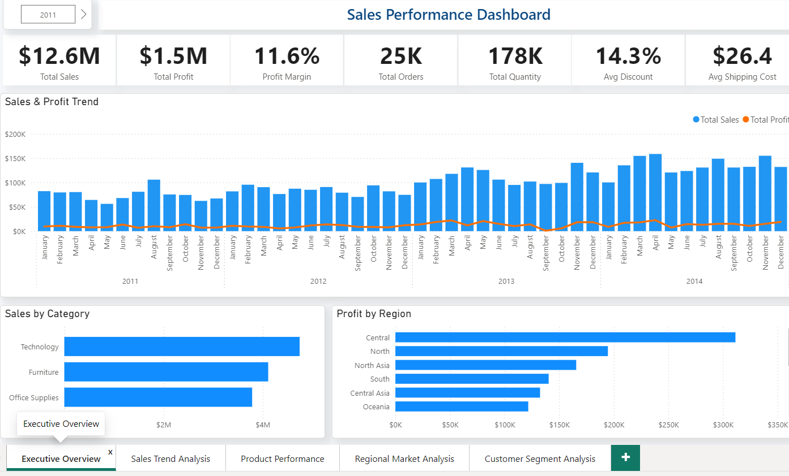
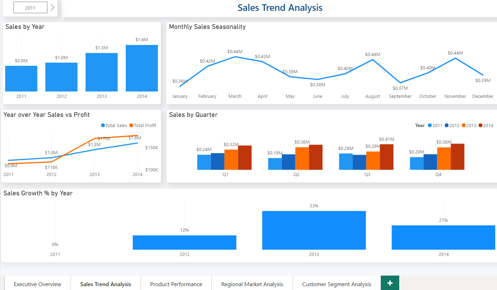
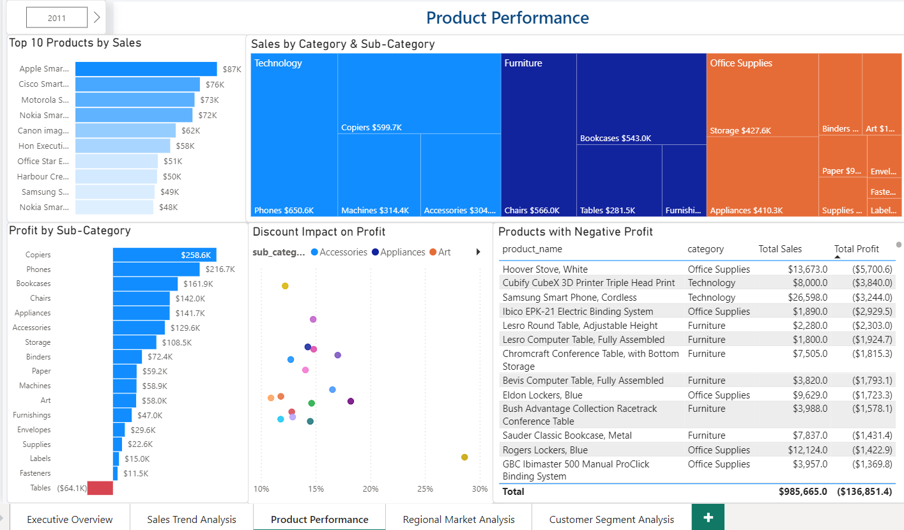
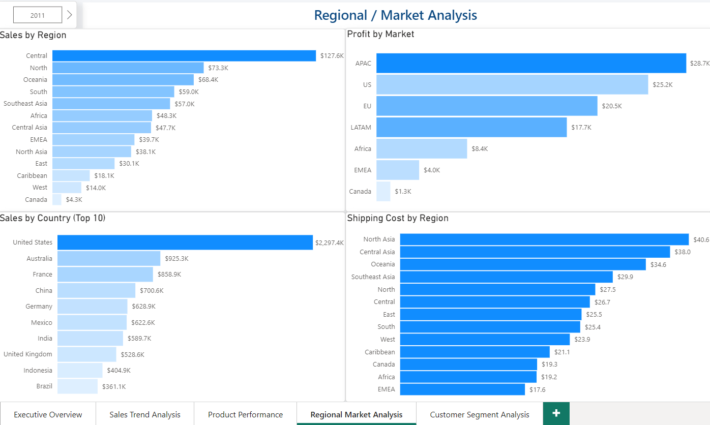
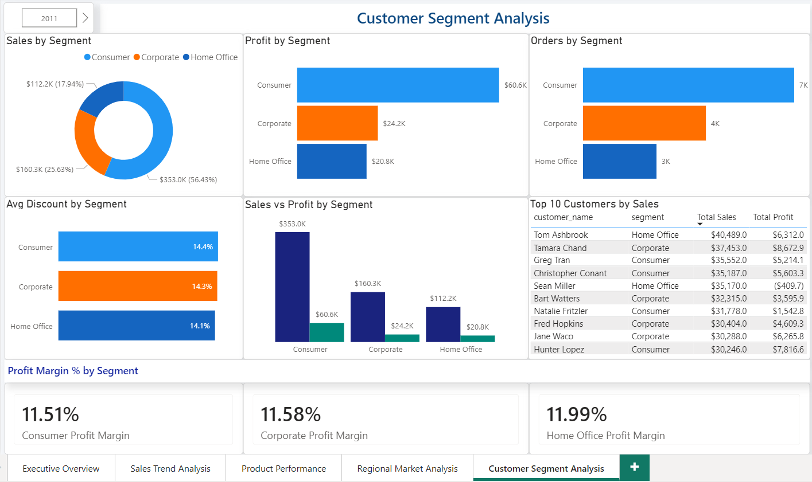

# Sales Dashboard Analysis
### Retail Sales Performance Analysis using Python, SQL, and Power BI


---

## Project Overview

This end-to-end data analytics portfolio project analyzes retail sales performance using the Kaggle SuperStore Sales dataset. The project demonstrates a complete analytics workflow — from raw data ingestion and Python-based cleaning, through SQL validation, to a multi-page interactive Power BI dashboard.

**Project Goal:** Analyze retail sales performance to uncover insights across sales trends, profit drivers, discount impact, product performance, regional performance, and customer segments.

---

## Analytics Workflow

```text
Raw CSV (Kaggle)
        │
        ▼
Python (pandas)
Data Cleaning & Feature Engineering
        │
        ▼
superstore_clean.csv
        │
   ┌────┴────┐
   ▼         ▼
SQLite   Power BI
Validation Dashboard
   │         │
   └────┬────┘
        ▼
Business Insights
```

---

## Dashboard Preview



---

## Tools & Technologies

| Tool | Purpose |
|---|---|
| Python (pandas) | Data cleaning and preparation |
| SQLite | Data validation and SQL analysis |
| Power BI | Interactive dashboard and visualizations |
| DB Browser for SQLite | SQL query execution |
| VS Code | Python scripting environment |

---

## Skills Demonstrated

- Data Cleaning and Preparation
- Data Transformation
- Feature Engineering
- SQL Aggregation and Validation
- Exploratory Data Analysis (EDA)
- KPI Development
- Dashboard Design
- Data Visualization
- Business Insight Generation
- Python (pandas)
- SQLite
- Power BI
- End-to-End Analytics Workflow

---

## Dataset

- **Source:** https://www.kaggle.com/datasets/rohitsahoo/sales-forecasting
- **Records:** ~10,000 rows
- **Period:** 2011 – 2014
- **Fields:** Order details, customer information, product categories, sales, profit, discount, and shipping information.

---

## Project Structure

```text
sales-dashboard-analysis/
│
├── data/
│   ├── raw/
│   │   └── SuperStoreOrders.csv
│   └── processed/
│       ├── superstore_clean.csv
│       ├── fact_sales.csv
│       ├── dim_product.csv
│       └── dim_geo.csv
│
├── python/
│   └── data_cleaning.py
│
├── sql/
│   └── validation_queries.sql
│
├── dashboard/
│   └── SalesDashboard.pbix
│
├── screenshots/
│
└── README.md
```

---

# Part 1: Python Data Cleaning

The raw CSV dataset was cleaned and transformed using Python and pandas.

### Data Preparation Steps

- Loaded raw CSV file
- Standardized column names
- Converted `order_date` and `ship_date` into datetime format
- Converted numeric columns:
  - sales
  - quantity
  - discount
  - profit
  - shipping_cost
- Created derived fields:
  - order_year
  - order_month
  - order_month_name
  - order_quarter
- Calculated:
  - profit_margin
  - shipping_days
- Removed duplicate rows
- Exported cleaned CSV files for downstream analysis

### Output Files

- superstore_clean.csv
- fact_sales.csv
- dim_product.csv
- dim_geo.csv

> **AI Assistance Note**
>
> The Python cleaning script was developed with the assistance of Codex (AI coding assistant). I independently reviewed, executed, validated, and understood all transformation logic and outputs before using them in the project.

---

# Part 2: Power BI Dashboard

A five-page interactive Power BI dashboard built from the cleaned dataset (`superstore_clean.csv`).

---

## Page 1: Executive Overview

High-level KPI summary with sales trends and category performance.


### KPI Cards

| KPI | Value |
|---|---|
| Total Sales | $12.6M |
| Total Profit | $1.47M |
| Profit Margin | 11.6% |
| Total Orders | 25K |
| Total Quantity | 178K |
| Avg Discount | 14.3% |
| Avg Shipping Cost | $26.38 |

### Visuals

- KPI Cards
- Sales Trend
- Profit Trend
- Sales by Category
- Profit by Region

---

## Page 2: Sales Trend Analysis

Deep dive into year-over-year growth and seasonality.



### Key Insights

- Sales grew consistently from 2011 to 2014.
- Strongest annual growth occurred in 2013.
- Sales typically dip during June–July before recovering in Q4.
- High sales do not always translate into high profit.

### Visuals

- Sales by Year
- Monthly Sales Trend
- Quarterly Sales
- Sales vs Profit
- Sales Growth %

---

## Page 3: Product Performance

Product and category profitability analysis.



### Key Insights

- Technology generates the highest sales and profit margin.
- Furniture has relatively low profitability.
- Tables is the only loss-making sub-category.
- High discounts are strongly associated with lower profits.

### Visuals

- Top 10 Products
- Treemap by Category
- Profit by Sub-Category
- Discount vs Profit Scatter Plot
- Negative Profit Products Table

---

## Page 4: Regional / Market Analysis

Regional and market-level performance comparison.



### Key Insights

- Central region contributes the highest sales.
- APAC delivers strong profitability.
- Canada has the highest profit margin.
- Southeast Asia shows high sales but weak margins.

### Visuals

- Sales by Region
- Profit by Market
- Top Countries by Sales
- Shipping Cost by Region

---

## Page 5: Customer Segment Analysis

Customer and segment profitability analysis.



### Key Insights

- Consumer segment contributes the largest share of revenue.
- Profit margins are relatively stable across segments.
- Some top-selling customers generate low or negative profit.

### Visuals

- Sales by Segment
- Profit by Segment
- Orders by Segment
- Average Discount by Segment
- Top Customers Table
- Profit Margin Cards

---

# Part 3: SQL Validation

SQL was used to independently validate all dashboard metrics.

### Analysis Performed

- Total Sales and Profit Validation
- Monthly Sales Trend
- Category Profitability
- Regional Performance
- Discount Impact Analysis
- Top Customers
- Product Profitability

### Example Query

```sql
SELECT
    ROUND(SUM(sales), 2) AS total_sales,
    ROUND(SUM(profit), 2) AS total_profit,
    ROUND(SUM(profit) / SUM(sales) * 100, 2) AS profit_margin_pct,
    COUNT(DISTINCT order_id) AS total_orders,
    SUM(quantity) AS total_quantity
FROM superstore_clean;
```

✅ All SQL calculations were validated against the Power BI dashboard.

📄 [View Full SQL Validation Queries](sql/validation_queries.sql)

---

# Key Business Insights

1. High discount levels significantly reduce profitability.
2. Technology is the strongest-performing category.
3. Furniture delivers high revenue but relatively weak margins.
4. Certain regions generate strong sales but low profits.
5. Sales growth remains consistently positive across the analysis period.
6. Not all top customers are equally profitable.
7. Data-driven pricing and discount optimization could improve overall margins.

---

# What I Learned

This project strengthened my understanding of the complete analytics lifecycle, from raw data preparation to executive reporting.

### Technical Skills

- Data cleaning using Python and pandas
- Feature engineering for reporting
- SQL aggregation and validation
- Power BI dashboard development
- KPI creation and business reporting

### Business Skills

- Translating raw data into actionable insights
- Identifying profitability drivers
- Understanding the relationship between discounts and margins
- Presenting findings through executive dashboards

### AI-Assisted Development

This project also strengthened my ability to work effectively with AI coding assistants by reviewing, validating, and understanding generated code rather than using it blindly.

---

# Author

**Joyce Lee**

**Data Analyst | Power BI | SQL | Python | PL-300 Certified**

- LinkedIn: https://www.linkedin.com/in/joyceleehy
- GitHub: https://github.com/joyceleehy
